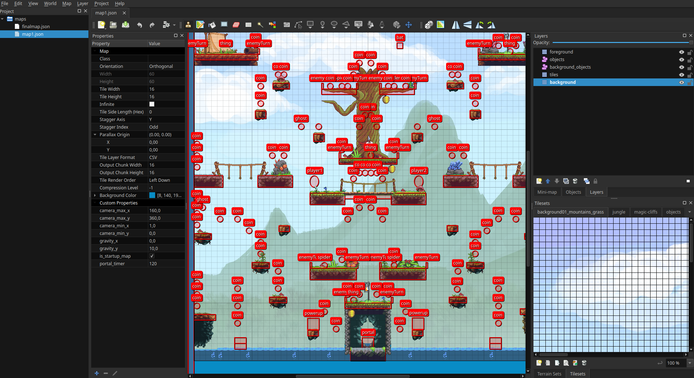

# Galder Game Jam 2023

A game jam with André Søberg and Robin Berg Pettersen that found place on 3.-5.november 2023.

# The Game

- `galder-game-jam-2023` contains simple code to showcase a very minimal
  and simple game concept.
- When compiled as `Debug` you also get:
  - The option to go to switch maps using the `F1`/`F2` keys.
  - Toggle infinite jump by pressing `F9`
  - Debug text via the debug manager.
- Player1 controls: - `A`/`D`: Move left/right. `W`: Jump. `C`: Hit. `Space`: Toggle sprite rotating with physics engine. `Enter`: Toggle camera following player. (Debug mode only)
- Player1 controls: - `Left`/`Right`: Move left/right. `Up`: Jump. `K`: Hit. `L`: Toggle sprite rotating with physics engine.

- The objective of the game is simple: Grab as many coins as you can before the portal opens! Fight the other player to kill him/her. Every death costs one coin. Only the player with the most coins can enter the portal and win! :monocle_face:

- All the content for the game is located inside the `content/game/content` folder. All the content inside the last `content` folder there is copied automatically to the output bin path via `CMake` when the `CMakeLists.txt` project is loaded. If any changes are done to these files, you can make sure the last files are updated by simply reloading the `CMakeLists.txt` file related to `raylib_template`. In `CLion` this is as easy as right-clicking the `CMakeLists.txt` file and choosing `Reload CMake Project`.

- Maps: The maps are created using `Tiled`, and uses a `tiled-project` on the top level. If you want to modify the map files, make sure things are loaded through opening the `gamedev.tiled-project` in `Tiled`. The reason why this is important is that some types can only be resolved through the common `tiled-project`.
  

# Game design document

Since the whole design process was a part of the game jam, the game design document is very limited, but
we have written down the [brainstorming](design/brainstorming/README.md) ideas.
As expected: Only a few of the ideas were small enough to fit the scope of creating a working game engine
with a playable game on a weekend.

# Development

- CMake is used as the build system, and `CLion` was used as `IDE`.
- Development has been done using `GCC 12.1`, so it's recommended to use an up-to-date version of `GCC`.
- The `MSVC` version bundled with `Visual Studio 2022` `v17.4.0` was used for the Windows build.

# Libraries used

| Name                                                 | Version | Description                                          |
| ---------------------------------------------------- | ------- | ---------------------------------------------------- |
| [Boost DI](https://github.com/boost-ext/di)          | 1.3.0   | For Dependency Injection support.                    |
| [Box2D](https://github.com/erincatto/box2d)          | 2.4.1   | For 2D physics.                                      |
| [Catch2](https://github.com/catchorg/Catch2)         | 2.13.10 | For Unit Tests                                       |
| [FakeIt](https://github.com/eranpeer/FakeIt)         | 2.4.0   | For Mocking/Faking objects for unit tests.           |
| [fmt](https://github.com/fmtlib/fmt)                 | 10.1.1  | Library for string formatting.                       |
| [RayLib](https://github.com/raysan5/raylib)          | 4.5.0   | For handling `Window`, `Graphics`, `Game input` etc. |
| [raylib-cpp](https://github.com/RobLoach/raylib-cpp) | 4.5.2   | Object oriented C++ wrapper for RayLib               |
| [Tileson](https://github.com/SSBMTonberry/tileson)   | 1.4.0   | For parsing `Tiled` json maps.                       |

# Graphics

Most of the graphics are taken from [OpenGameArt](https://opengameart.org).

The following graphics from [OpenGameArt](https://opengameart.org) are used in the game:

| Name                            | Creator         | License       | URL                                                                  |
| ------------------------------- | --------------- | ------------- | -------------------------------------------------------------------- |
| gem1/gem2/gem3/gem4             | Clint Bellanger | CC-BY-SA 3.0  | https://opengameart.org/content/gem-icons                            |
| bat.png                         | bagzie          | OGA-BY 3.0    | https://opengameart.org/content/bat-sprite                           |
| ninja.png                       | needcoffee      | Public Domain | https://opengameart.org/content/needcoffee%E2%80%99s-mostrichgrinser |
| greggman-backgrounds            | Zeyu Ren        | CC-BY 3.0     | https://opengameart.org/content/backgrounds-for-2d-platformers       |
| OPP Jungle Tiles                | Hapiel          | CC-BY 3.0     | https://opengameart.org/content/opp-jungle-tiles                     |
| 700+ RPG Icons                  | Lorc            | CC-BY 3.0     | https://opengameart.org/content/700-rpg-icons                        |
| Animated Explosions             | ansimuz         | CC0           | https://opengameart.org/content/animated-explosions                  |
| Golden UI                       | Buch            | CC0           | https://opengameart.org/content/golden-ui                            |
| melee/swoosh.png                | ?               | ?             | ?                                                                    |
| Gotthicvania Swamp              | ansimuz         | CC0           | https://opengameart.org/content/gotthicvania-swamp                   |
| Hero spritesheets (Ars Notoria) | Balmer          | CC0           | https://opengameart.org/content/hero-spritesheets-ars-notoria        |
| Portraits Generators            | aamatniekss     | ?             | https://itch.io/queue/c/1866028/portraits-generators?game_id=105631  |
| Rotating Coin                   | Puddin          | CC0           | https://opengameart.org/content/rotating-coin                        |
| Portals                         | LetargicDev     | CC0           | https://opengameart.org/content/portals                              |
